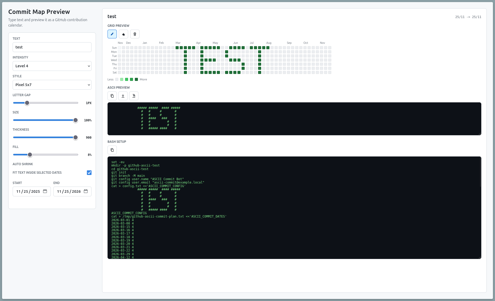

# GitHub ASCII Commit Map

Static HTML preview for writing text into a GitHub-style `7 x 52` commit
calendar.

Try it online: https://linventif.github.io/github-ascii-commit/

## Usage

Open `index.html` directly in a browser, or use the hosted version above. The
preview defaults to:

- text: `test`
- date range: today minus 6 months to today plus 6 months
- grid: 7 weekdays by 52 weeks

## Features

- text content
- git user name and email for generated commits
- contribution intensity
- font style
- letter spacing
- max text size
- text thickness
- fill density
- auto shrink toggle; disable it to let text overflow instead of being compressed
- pixel font mode for cleaner 7-row ASCII letters
- paint tools: pencil, eraser, and clear for live manual edits
- editable ASCII preview; editing the text updates the calendar grid
- ASCII toolbar: copy, import/normalize, and download JSON
- bash setup preview to create a local git repo and generate the dated commits

## Workflow

1. Design the contribution map in the grid or ASCII editor.
2. Copy the generated bash setup.
3. Run it locally to create the dated commits.
4. Add your GitHub remote and push.
